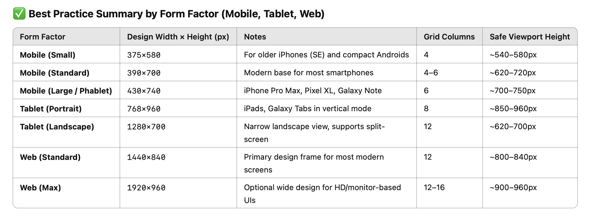

# Responsive Guidelines

## Overview

SC Design System follows a mobile-first approach with responsive breakpoints and layouts optimized for various screen sizes.

## Breakpoints

| Device Type | Breakpoint | Container Width | Columns |
|------------|------------|-----------------|---------|
| Mobile     | < 768px    | 100%            | 4       |
| Tablet     | 768px      | 720px           | 8       |
| Desktop    | 1024px     | 960px           | 12      |
| Large      | 1440px     | 1280px          | 12      |



## Grid System

Our 12-column grid system adapts to different screen sizes:

```html
<div class="container">
  <div class="row">
    <div class="col-12 col-md-6 col-lg-4">
      <!-- Content -->
    </div>
  </div>
</div>
```

## Responsive Utilities

### Display
- `d-none`: Hide on all devices
- `d-md-block`: Show on medium devices and up
- `d-lg-none`: Hide on large devices

### Spacing
- `p-3`: Padding on all sides
- `px-md-4`: Horizontal padding on medium devices
- `my-lg-5`: Vertical margin on large devices

### Text
- `text-center`: Center text
- `text-md-left`: Left-align text on medium devices
- `text-lg-right`: Right-align text on large devices

## Best Practices

1. **Mobile First**: Start with mobile layouts and enhance for larger screens
2. **Fluid Images**: Use `img-fluid` class for responsive images
3. **Touch Targets**: Minimum 44px × 44px for interactive elements
4. **Readable Text**: Minimum 16px font size for body text
5. **Safe Areas**: Account for device notches and system UI 